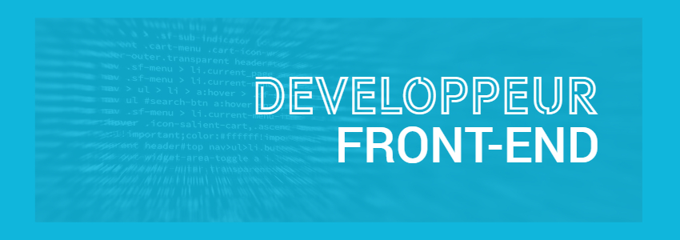

### Hi, I'm Nicolas 👋

 
 Je suis un développeur passionné par la réalisation et le développement de projets web. J'aime travailler avec des technologies comme ReactJs en Jamstack (JavaScript, APIs + Markup) et Redux. J'ai eu l'occasion de faire mes armes à l'université de Lille où j'ai participé à un projet de gestionnaire de réservation de salles de travail au sein de la bibliothéque universitaire.
 
📫 Comment me contacter : [LinkedIn](www.linkedin.com/in/nicolasdlb)
<!-- ### Bonjour et bienvenue 👋

Vous voici chez moi, dans mon laboratoire.

📫 Comment me contacter : [LinkedIn](www.linkedin.com/in/nicolasdlb)

### 🦥 Qui suis-je ?
Je suis un développeur passionné, déterminé et investi. Je travaille sur des projets qui me parlent, dans des équipes bienveillantes où exigeance rime avec bonne ambiance.

J'ai eu l'occasion de faire mes armes à l'université de Lille dans laquelle j'ai pu participer à la naissance d'un très beau projet autant d'un point de vue de l'élaboration que de sa construction.

### Mes compétences
#### Techniques
🔭 Les technos avec lesquelles je travaille:

 
React  
Redux  
Typescript  
NodeJS  
Jest/Enzyme  
Firebase
 -->
